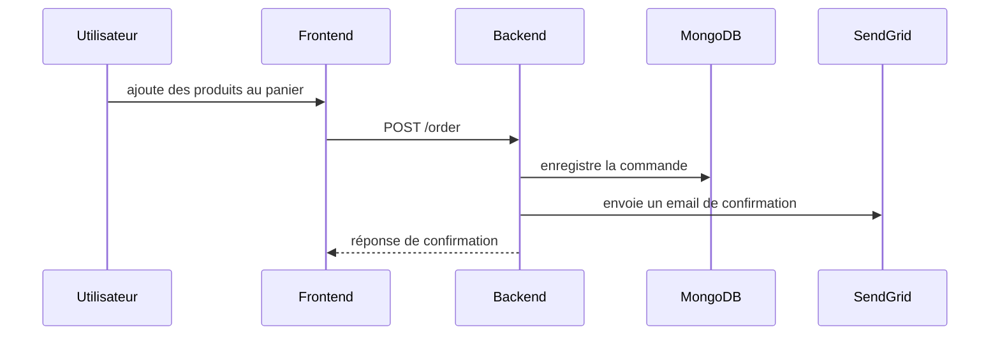

```mermaid
sequenceDiagram
    participant Utilisateur
    participant Frontend
    participant Backend
    participant MongoDB
    participant SendGrid

    Utilisateur->>Frontend: ajoute des produits au panier
    Frontend->>Backend: POST /order
    Backend->>MongoDB: enregistre la commande
    Backend->>SendGrid: envoie un email de confirmation
    Backend-->>Frontend: réponse de confirmation
```
