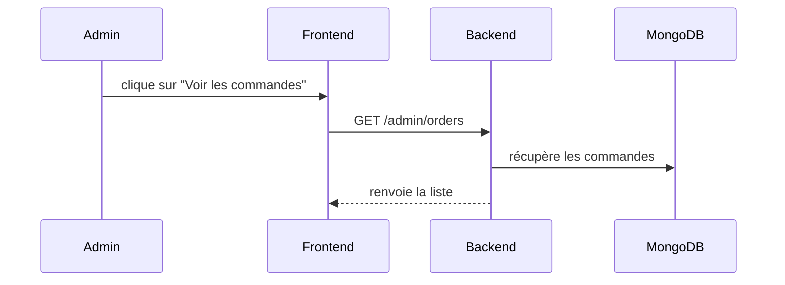

```mermaid
sequenceDiagram
    participant Admin
    participant Frontend
    participant Backend
    participant MongoDB

    Admin->>Frontend: clique sur "Voir les commandes"
    Frontend->>Backend: GET /admin/orders
    Backend->>MongoDB: récupère les commandes
    Backend-->>Frontend: renvoie la liste
```
